## STEP 1 — INSTALLING APACHE AND UPDATING THE FIREWALL

### Update the list of packages in the package manager
`sudo apt update`

### Install the apache2 package
`sudo apt install apache2`

### Verify if the apache service is running
`sudo systemctl status apache2`

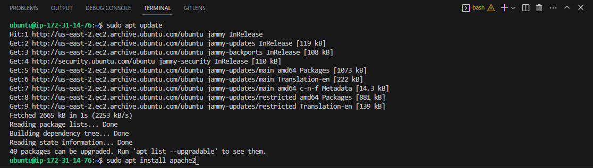

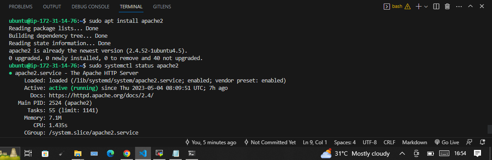

We need to open TCP port 80 which is the default port that web browsers use to access web pages on the Internet.
So we need to add a rule to EC2 configuration to open inbound connection through port 80:

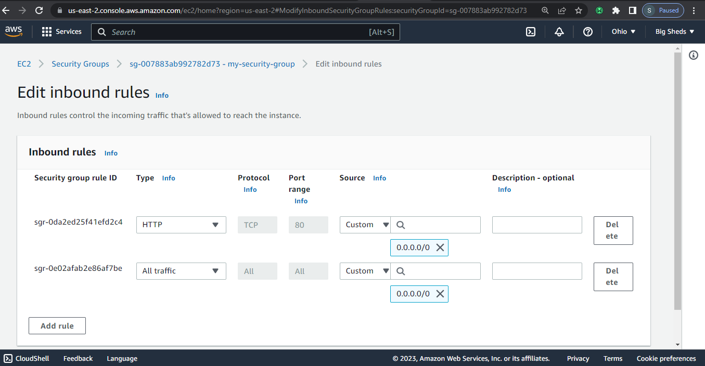
Our server is running and we can access it locally and from the Internet.

**Try to access the server from our shell Run ;**

` curl http://localhost:80`

or 

` curl http://127.0.0.1:80`

**Access your Webserver using the url below:**

`http://<Public-IP-Address>:80`

**It should display:**

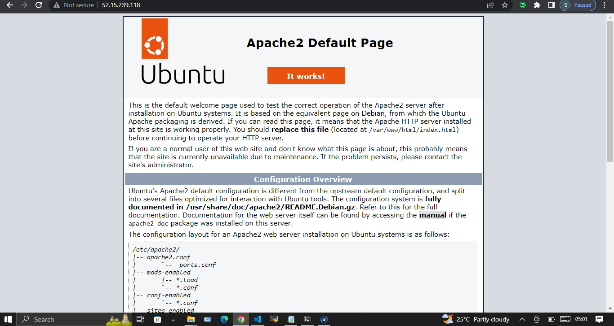

## STEP 2 — INSTALLING MYSQL

We need to install a Database Management System (DBMS) to be able to store and manage data for your site in a relational database. So we Install MYSQL by running ;

`sudo apt install mysql-server`

**Log in to the MySQL console**

` sudo mysql`

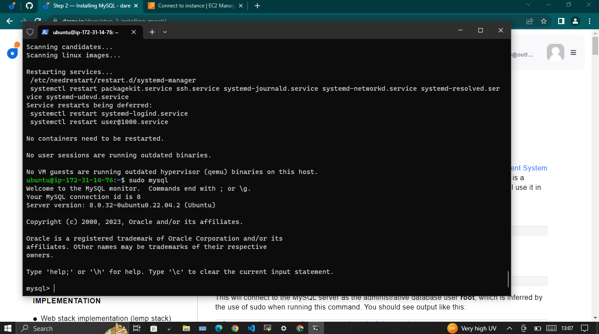

It’s recommended that you run a security script that comes pre-installed with MySQL. This script will remove some insecure default settings and lock down access to your database system. Before running the script you will set a password for the root user, using mysql_native_password as default authentication method. We’re defining this user’s password as PassWord.1.

`ALTER USER 'root'@'localhost' IDENTIFIED WITH mysql_native_password BY 'PassWord.1';`

**Exit the MySQL shell with:**

`mysql> exit`

Start the interactive script by running:

`sudo mysql_secure_installation`

This will ask if you want to configure the VALIDATE PASSWORD PLUGIN.

*Run preinstalled mysql script to lock down database access. It will prompt to Configure Password validation. Enter Y to accept or any other character to object. Enter Y subsequently when prompted to complete the process.*

**Test if you’re able to log in to the MySQL console by running;**

`sudo mysql -p`

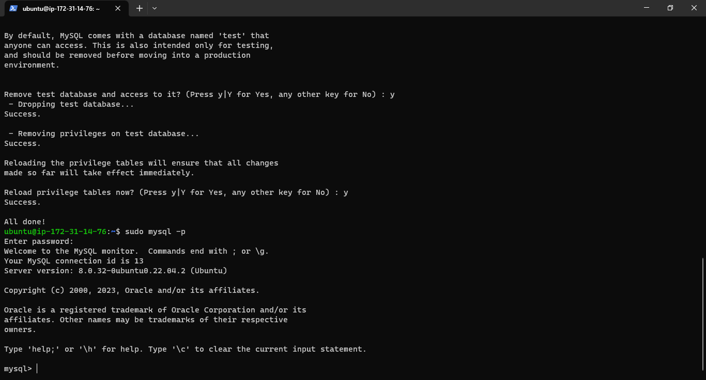

The -p flag in this command, which will prompt you for the password used after changing the root user password.

`mysql> exit`

## STEP 3 — INSTALLING PHP

**PHP is the component of our setup that will process code to display dynamic content to the end user. In addition to the php package, you’ll need php-mysql, a PHP module that allows PHP to communicate with MySQL-based databases. You’ll also need libapache2-mod-php to enable Apache to handle PHP files.**

`sudo apt install php libapache2-mod-php php-mysql`

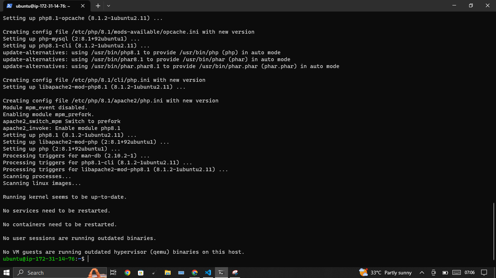

### Run the command to know the PHP version;

`php -v`

**LAMP stack is completely installed and fully operational**

## STEP 4 — CREATING A VIRTUAL HOST FOR YOUR WEBSITE USING APACHE.

**Create the directory for projectlamp using ‘mkdir’ command as follows:**

`sudo mkdir /var/www/projectlamp`

**Next, assign ownership of the directory with your current system user:**

` sudo chown -R $USER:$USER /var/www/projectlamp`

**Then, create and open a new configuration file in Apache’s sites-available directory using vim.**

`sudo vi /etc/apache2/sites-available/projectlamp.conf`

**This will create a new blank file. Paste in the following bare-bones configuration by hitting on i on the keyboard to enter the insert mode, and paste the text:**

`<VirtualHost *:80>
    ServerName projectlamp
    ServerAlias www.projectlamp 
    ServerAdmin webmaster@localhost
    DocumentRoot /var/www/projectlamp
    ErrorLog ${APACHE_LOG_DIR}/error.log
    CustomLog ${APACHE_LOG_DIR}/access.log combined
</VirtualHost>`

You can use the `ls` command to show the new file in the sites-available directory

`sudo ls /etc/apache2/sites-available`

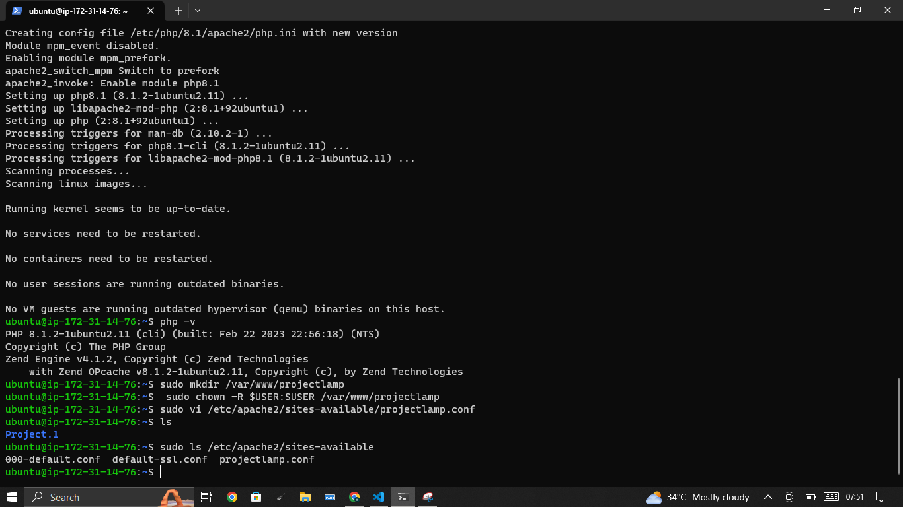

**You can now use a2ensite command to enable the new virtual host:**

` sudo a2ensite projectlamp`

**To disable Apache’s default website use a2dissite command , type:**

`sudo a2dissite 000-default`

**To make sure your configuration file doesn’t contain syntax errors, run:**

`sudo apache2ctl configtest`

**reload Apache so these changes take effect:**

`sudo systemctl reload apache2`

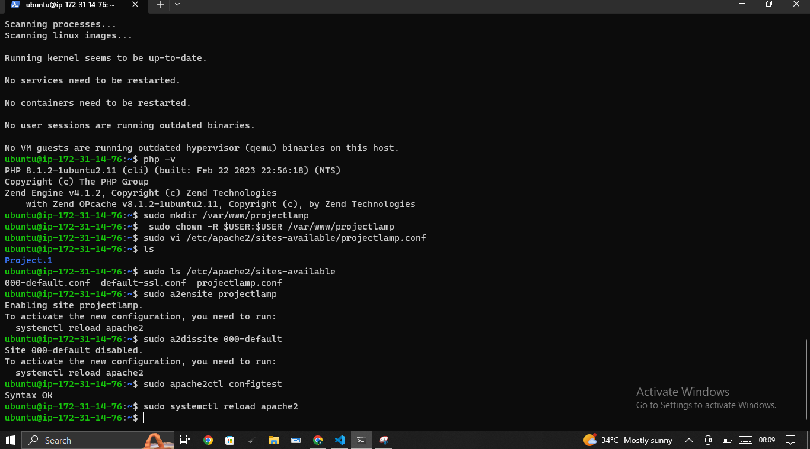

**Your new website is now active, but the web root /var/www/projectlamp is still empty. Create an index.html file in that location so that we can test that the virtual host works as expected:**

`sudo echo 'Hello LAMP from hostname' $(curl -s http://169.254.169.254/latest/meta-data/public-hostname) 'with public IP' $(curl -s http://169.254.169.254/latest/meta-data/public-ipv4) > /var/www/projectlamp/index.html`

**Go to your browser and try to open your website URL using IP address:** 

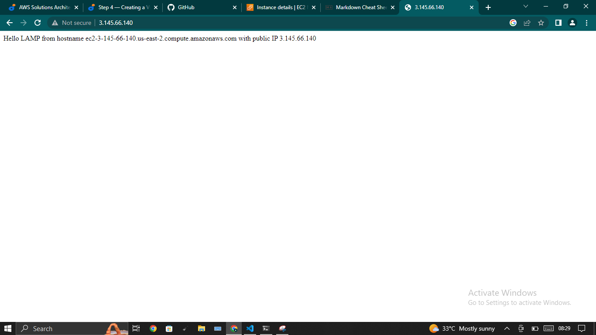

**If you see the text from ‘echo’ command you wrote to index.html file, then it means your Apache virtual host is working as expected**

## STEP 5 — ENABLE PHP ON THE WEBSITE

**We need to edit the /etc/apache2/mods-enabled/dir.conf file and change the order in which the index.php file is listed within the DirectoryIndex directive, so index.html takes precedence over index.php**

`sudo vim /etc/apache2/mods-enabled/dir.conf`

**Edit with Vim**

`<IfModule mod_dir.c>
        #Change this:
        #DirectoryIndex index.html index.cgi index.pl index.php index.xhtml index.htm
        #To this:
        DirectoryIndex index.php index.html index.cgi index.pl index.xhtml index.htm
</IfModule>`

**After saving and closing the file, you will need to reload Apache so the changes take effect:**

`sudo systemctl reload apache2`

**We will create a PHP script to test that PHP is correctly installed and configured on your server.**

**Create a new file named index.php inside your custom web root folder:**

`vim /var/www/projectlamp/index.php`

This will open a blank file. Add the following text, which is valid PHP code, inside the file:

`<?php`

`phpinfo();`

**Save and close the file, refresh the page and you will see a page similar to this:**

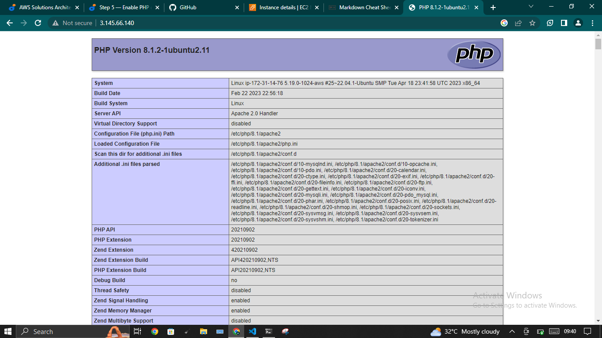

**After checking the relevant information about your PHP server through that page, it’s best to remove the file you created as it contains sensitive information about your PHP environment -and your Ubuntu server. You can use rm to do so**

`sudo rm /var/www/projectlamp/index.php`

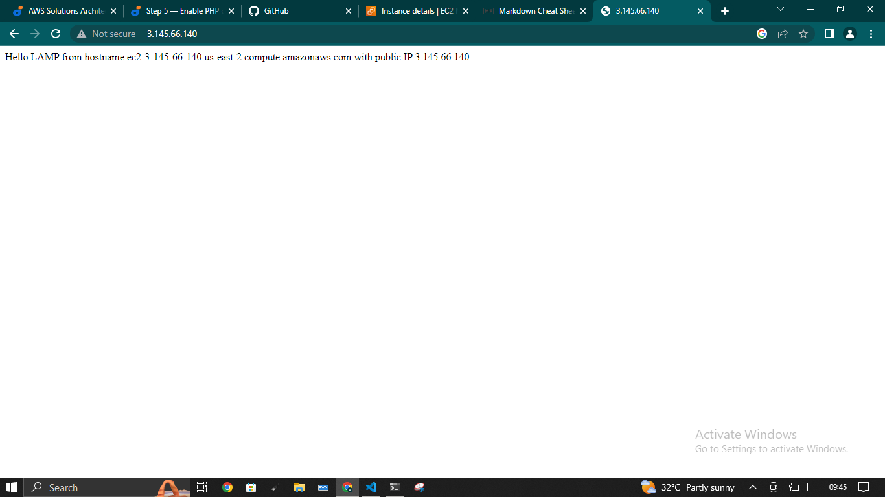

